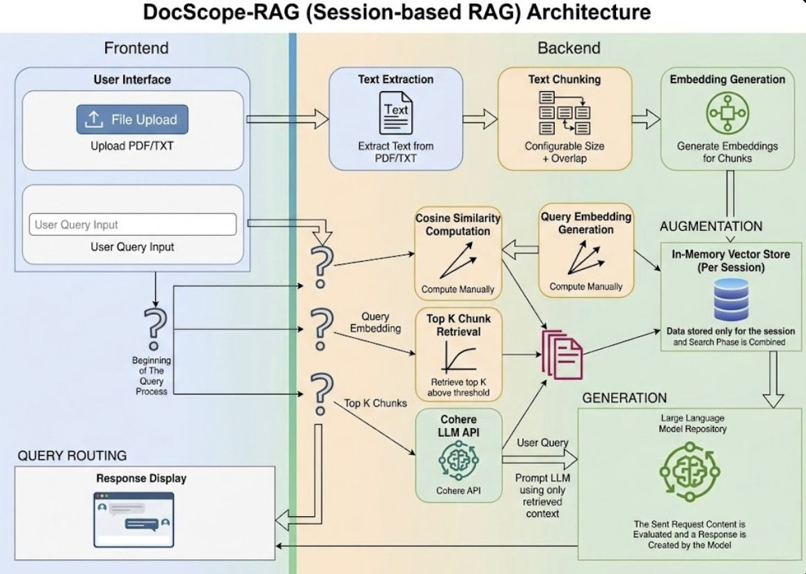

# **DocScope-RAG**

Session-Based Retrieval-Augmented Generation (RAG) application built using **Next.js (Frontend)** and **Node.js + Express (Backend)** with strict TypeScript.

---

## **Why the Name "DocScope"?**

The name **DocScope** is derived from:

- **Doc** → Represents uploaded documents (.pdf / .txt)
- **Scope** → The system strictly answers *within the scope* of uploaded content

The model is restricted to document boundaries and rejects any out-of-scope queries.

This reflects the core principle of the system:

> Controlled, session-based, scope-limited AI retrieval.

---

## **Overview**

DocScope-RAG allows users to:

- Upload PDF or TXT documents
- Automatically chunk and embed content
- Ask contextual questions
- Receive answers grounded strictly in uploaded documents
- Reject unrelated questions safely

The system prevents hallucination using threshold-based retrieval and prompt-level guardrails.

---

## **Tech Stack**

### **Frontend**
- Next.js (App Router)
- TypeScript
- Tailwind CSS

### **Backend**
- Node.js (Runtime)
- Express.js (Frame Work)
- TypeScript

### **AI / Embeddings**
- Cohere API (LLM + Embeddings)

### **Document Processing**
- pdf-parse (PDF extraction)

---

## **Setup Instructions**

### **1️⃣ Clone Repository**

```bash
git clone https://github.com/YOUR_USERNAME/DocScope-RAG.git
cd DocScope-RAG
```

---

### **2️⃣ Backend Setup**

```bash
cd backend
npm install
```

Create a `.env` file inside the `backend/` folder:

```env
COHERE_API_KEY=your_api_key_here
```

Run backend server:

```bash
npm run dev
```

Backend runs at:

```
http://localhost:5000
```

---

### **3️⃣ Frontend Setup**

```bash
cd frontend
npm install
npm run dev
```

Frontend runs at:

```
http://localhost:3000
```

---

## **Architecture Overview**

### High-Level Flow

1. User uploads document (PDF / TXT)
2. Backend extracts raw text
3. Text is chunked (configurable size + overlap)
4. Embeddings generated per chunk
5. Stored in in-memory vector store (per session)
6. User submits question
7. Query embedding generated
8. Manual cosine similarity computed
9. Top K chunks retrieved (above threshold)
10. LLM prompted using ONLY retrieved context
11. Final grounded answer returned

---

## **Architecture Diagram**



---

## **Chunking Strategy**

Text is split into chunks using:

- **Configurable chunk size** (default: 500 characters)
- **Configurable overlap** (default: 50 characters)

Overlap ensures contextual continuity between adjacent chunks.

Each chunk:
- Generates its own embedding
- Is stored along with embedding
- Is isolated per session

---

## **Retrieval Flow**

When a question is asked:

1. Generate embedding for question
2. Compute cosine similarity manually:

```ts
similarity = dotProduct / (magnitudeA * magnitudeB)
```

3. Apply similarity threshold filter
4. Sort by similarity descending
5. Select Top K chunks
6. If no chunk passes threshold:

```
"This question is outside the scope of uploaded documents"
```

7. Otherwise:
   - Build prompt using retrieved chunks only
   - Send to LLM
   - Return grounded response

---

## **Guardrail Logic**

Hallucination prevention is enforced using two layers:

### 1️⃣ Backend Threshold Enforcement

If similarity score is below threshold → system rejects.

### 2️⃣ Prompt-Level Enforcement

LLM receives strict instruction:

```
Use ONLY the provided context.
If answer is not in context, respond:
"This question is outside the scope of uploaded documents"
```

This ensures the model does not use external knowledge.

---

## **Session Management**

- Unique `sessionId` generated on initial load
- All embeddings stored per session
- No cross-session leakage
- Clear session endpoint removes stored vectors

Vector storage is implemented as an in-memory store (as required).

---

## **UI Features**

- Drag & Drop file upload
- Upload status display
- Session ID display
- Document count
- Chunk count
- Retrieval settings:
  - Top K
  - Similarity threshold
  - Chunk size
  - Overlap
- Chat interface
- Retrieved chunks display
- Similarity scores
- Response time logging
- Dynamic session status indicator

---

## **Third-Party Packages Used**

### Backend
- express — API server
- cohere-ai — LLM + embeddings
- pdf-parse — PDF text extraction
- nodemon — Development server

### Frontend
- next — Framework
- tailwindcss — Styling

---

## **Known Limitations**

- Vector store is in-memory (data lost on restart)
- Currently supports one document per session
- No external vector database integration
- No advanced token-length truncation logic

---

## **Future Improvements**

- Support multiple document uploads per session
- Integrate Pinecone or ChromaDB
- Pre-normalize embeddings for optimized similarity
- Add persistent storage layer
- Implement token-length management

---

## **Demo**

The demo demonstrates:

- File upload from frontend
- Chunk creation
- Valid question answering
- Out-of-scope rejection

The Demonstration video is added and mentioned as Demo.mp4 .


---

## **Conclusion**

DocScope-RAG strictly follows:

- Session-based isolation
- Manual cosine similarity implementation
- Configurable retrieval logic
- Guardrail-enforced hallucination prevention
- Strict TypeScript usage

This ensures controlled, explainable, and grounded AI responses.
